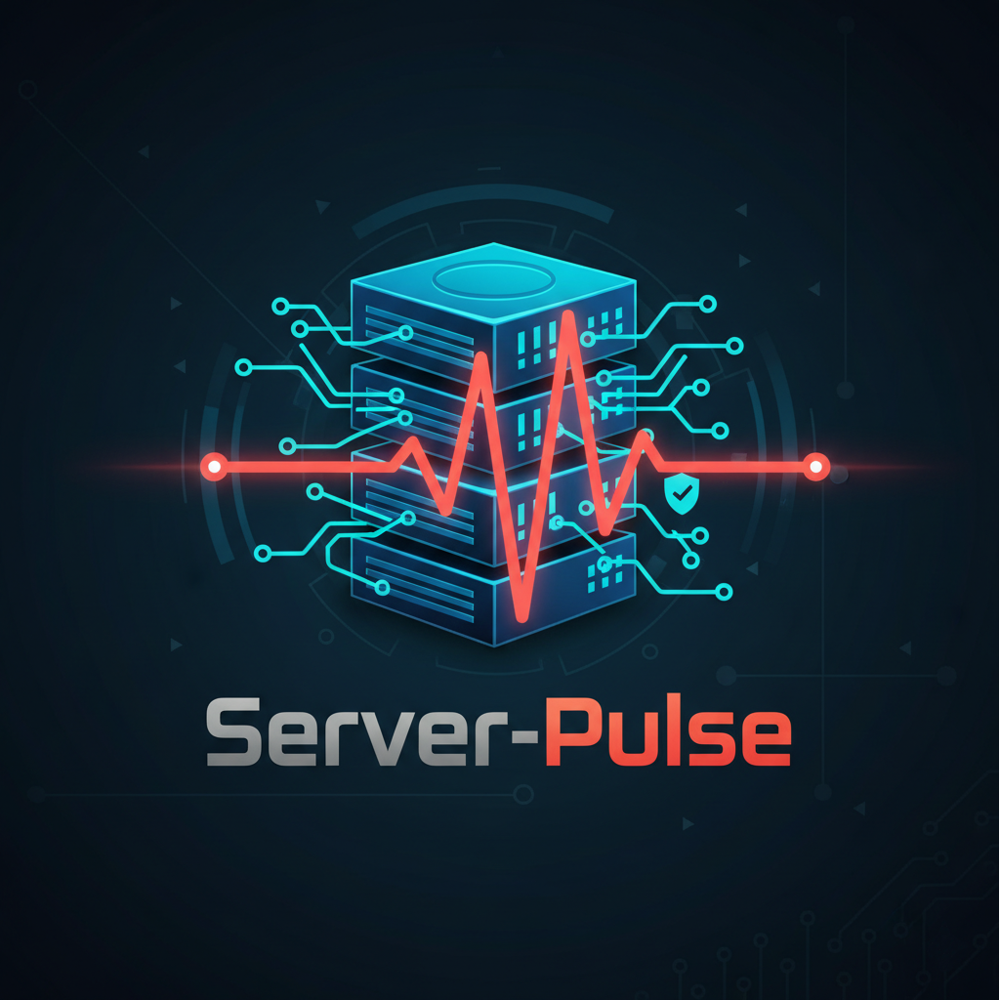

<p align="center"></p>

# Server Pulse 🚀


<p align="center"></p>

## Installation

### From Source (Recommended)

#### Prerequisites
- Go 1.24+
- Git

```bash
git clone https://github.com/System-Pulse/server-pulse.git
cd server-pulse
make build
sudo mv server-pulse /usr/local/bin/
```

### Pre-built Binaries (Linux/macOS)


**curl :**

```bash
curl -fsSL https://raw.githubusercontent.com/System-Pulse/server-pulse/master/scripts/install.sh | bash
```

**wget :**

```bash
wget -qO- https://raw.githubusercontent.com/System-Pulse/server-pulse/master/scripts/install.sh | bash
```

---

## 🧹 Uninstallation

**curl :**

```bash
curl -fsSL https://raw.githubusercontent.com/System-Pulse/server-pulse/master/scripts/uninstall.sh | bash
```

**wget :**

```bash
wget -qO- https://raw.githubusercontent.com/System-Pulse/server-pulse/master/scripts/uninstall.sh | bash
```


Download the latest binary for Linux amd64:

```bash
sudo wget https://github.com/System-Pulse/server-pulse/releases/download/vX.X.X/server-pulse-X.X.X-linux-amd64 -O /usr/local/bin/server-pulse
sudo chmod +x /usr/local/bin/server-pulse
```

## Building

Build steps:

1. Clone the repository:
```bash
git clone https://github.com/System-Pulse/server-pulse.git
cd server-pulse
```

2. Build for your current platform:
```bash
make build
```

3. For cross-platform builds:
```bash
make build-all
```

Build artifacts will be placed in the `_build` directory.
